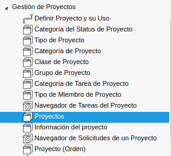
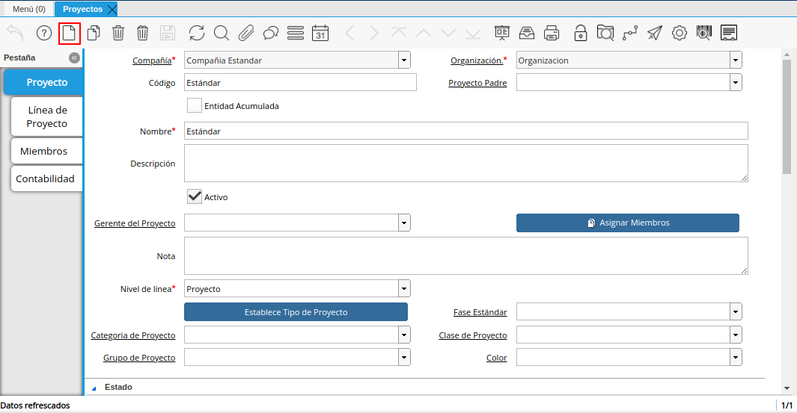
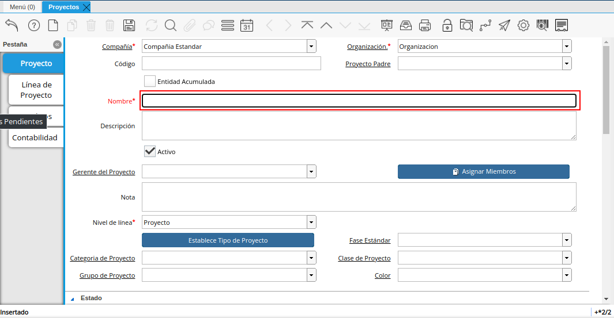
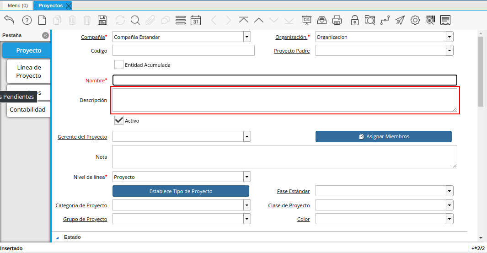
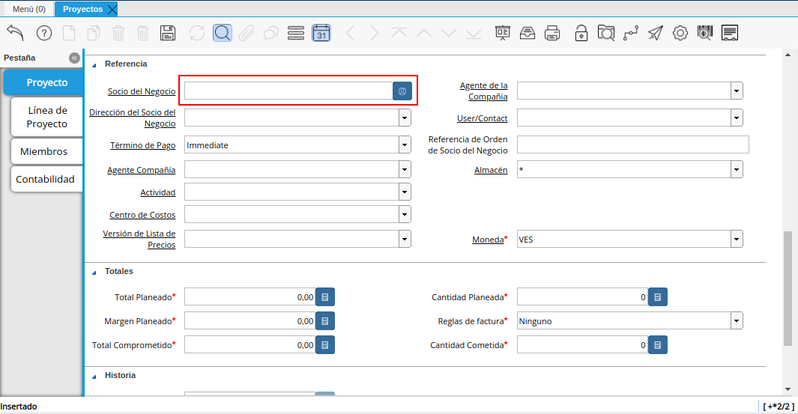

.. |campo organización| image:: resources/organizacion.png

.. |campo nivel de la linea| image:: resources/nivel-de-linea.png

.. _documento/Gestión de Proyectos:

**Crear Proyectos**
===================

La ventana de proyectos en adempiere es usada para definir los proyectos y los posibles productos a utilizar en dicho proyecto, los cuales serán monitoreados por medio de documentos como las ordenes de venta.

**Registro de un Proyecto**
Ubique y seleccione en el menú de ADempiere, la carpeta **“Gestión de Proyectos**, luego seleccione la ventana **“Proyectos”**.

   |menú de adempiere 2|

Imagen 1. Menú ADempiere

Podrá visualizar la ventana **“Proyectos”**, con todos los registros de proyectos.

   |ventana proyecto|
Imagen2 Ventana Proyecto

Seleccione en el icono **“Registro Nuevo”**, ubicado en la barra de herramientas de ADempiere, para crear un nuevo registro en la ventana **“Proyectos”**.

   |nuevo proyecto|
Imagen3 Nuevo Registro

Seleccione en el campo **“Organización"**, la organización para la cual esta realizando el documento.

   |campo organización|
Imagen4 organización

Introduzca en el campo **“Nombre”**, el nombre con el que va identificar el proyecto.

   |campo nombre|
Imagen5 nombre

Introduzca en el campo **“Descripción”**, una breve descripción del proyecto que se encuentra realizando, no es un campo obligatorio por lo tanto es opcional.

   |campo descripción|
Imagen6 Descripción

Seleccione en el campo **Nivel de línea** el nivel del proyecto, este campo indica como se va a manejar el proyecto que se encuentra realizando, tiene tres opciones: *Fase*, *Proyecto*, *tarea*.

   |campo nivel de linea|
Imagen6 Nivel de Linea

Introduzca en el campo **Socio del Negocio** el nombre de la persona o empresa a la que se le esta relizando el proyecto.

   |campo socio del negocio|
Imagen6 Socio del Negocio
